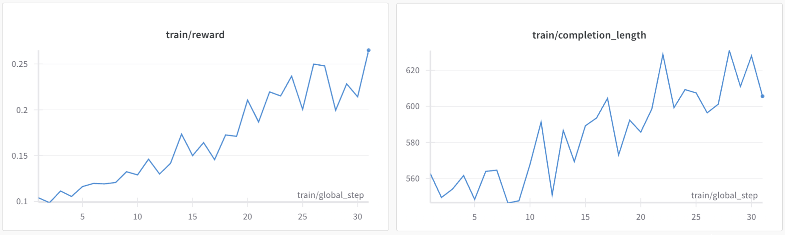

# smolR1


reproducing DeepSeek R1 Zero with Qwen2.5-0.5B on two 4090 GPUs

## Training Plots


## Setup
Create a virtual environment and install dependencies with 
```bash
pip install -r requirements.txt
```


For a two GPU setup, start vLLM first.

```bash
CUDA_VISIBLE_DEVICES=1 trl vllm-serve --model Qwen/Qwen2.5-0.5B
```

Then run training with

```bash
accelerate launch --config_file configs/deepspeed/zero3.yaml --num_processes 1 train.py
```

## Evaluation
Follow instructions in [`eval/README.md`](eval/README.md).

## Acknowledegments

[simpleRL-Zoo](https://github.com/hkust-nlp/simpleRL-reason)

[Qwen2.5 Math Evaluation](https://github.com/QwenLM/Qwen2.5-Math)
